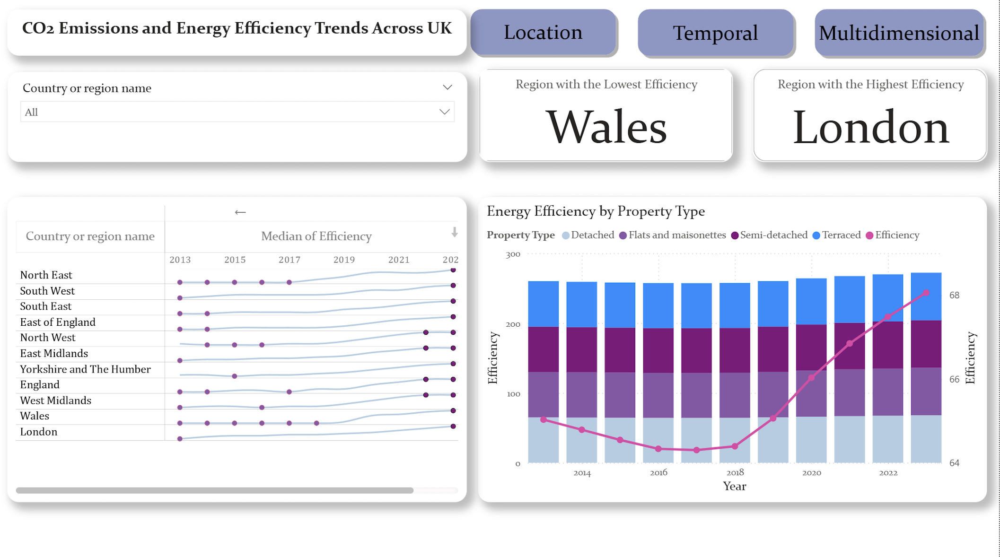
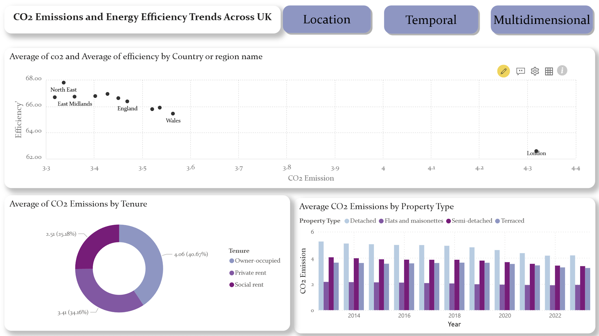

# UK CO2 Emissions & Energy Efficiency Analytics Dashboard

An interactive Power BI dashboard analyzing the relationship between domestic $CO_2$ emissions, energy efficiency, property types, and housing tenure across the United Kingdom (2013–2023).

##  Project Overview
This dashboard was developed to visualize how residential energy efficiency correlates with carbon output. By analyzing spatial, temporal, and multidimensional factors, the report identifies which sectors of the UK housing market are leading in efficiency and which are lagging behind.


##  Dashboard Previews

### 1. Location View
Focuses on geographical distribution across the UK, identifying emission hotspots by region.


---

### 2. Temporal View
Tracks energy efficiency trends over a 10-year period (2013–2023), highlighting the sharp upward trend in recent years.


---

### 3. Multidimensional View
Explores the correlation between efficiency and emissions, featuring a scatter plot and tenure-based analysis.


---

## 🔍 Key Insights
* **The Efficiency-Emission Link:** A clear inverse correlation is visible in the scatter plot; as the "Efficiency" score increases, average $CO_2$ emissions drop significantly.
* **Tenure Disparity:** Owner-occupied properties consistently show higher total emissions compared to social and private rentals, highlighting a key area for policy intervention.
* **Property Type:** Detached homes remain the highest $CO_2$ contributors, while flats and maisonettes maintain the lowest footprint per household.
* **Regional Leaders:** London and the North East show distinct trends in efficiency, with Wales historically showing lower efficiency scores in certain property segments.

---

##  Technical Features
* **Dynamic Navigation:** Implemented a custom button-based navigation bar (Location, Temporal, Multidimensional) for a seamless user experience.
* **Synchronized Slicers:** Global filters for "Region" and "Year" allow for granular drill-downs that persist across different report pages.
* **Data Modeling:** Integrated multiple variables including tenure, property type, and regional coordinates from a single cleaned Excel source.
* **Visual Variety:** Includes Shape Maps for spatial analysis, Ribbon/Bar charts for categorical breakdowns, and Scatter plots for correlation analysis.

---

##  Project Structure
```text
├── Report/
│   └── dash.pbix               # Power BI Desktop file
├── Data/
│   └── co2abdefficiency.xlsx   # Source dataset
├── Screenshots/
│   ├── Location.png       
│   ├── Temporalpng       
│   └── Multidimensional.png 
└── README.md
